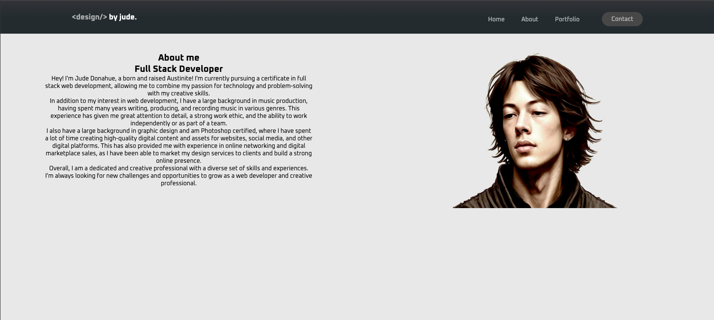

# Portfolio-Demo

## Description

I put this project together to demonstrate the skills I have been practicing in the UT coding bootcamp. This is a webpage that potential employers can look at and learn about me, the skills I have to offer, and previous works I have created or provided work on. 

## Installation

Link to deployed webpage: https://judemdonahue.github.io/Portfolio-Demo/

## Usage

## Credits

https://github.com/judemdonahue

## License

MIT License

---

